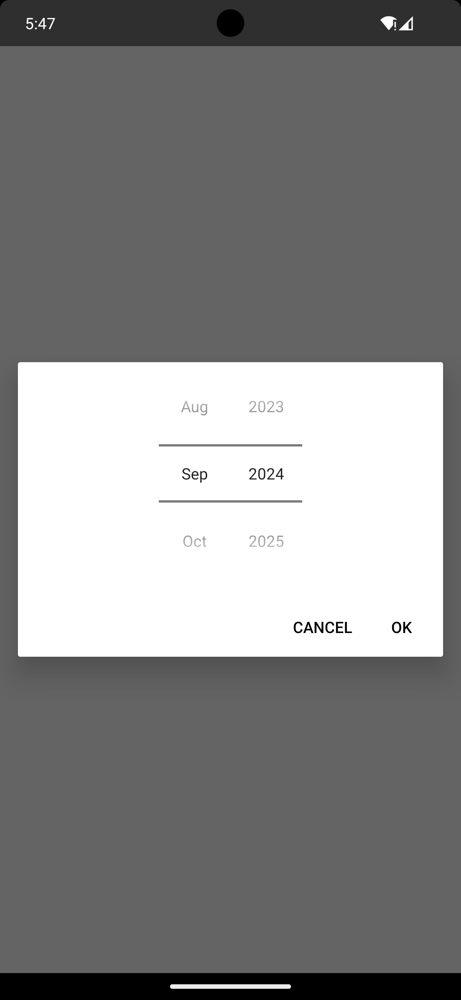
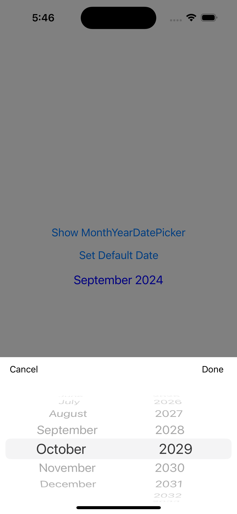
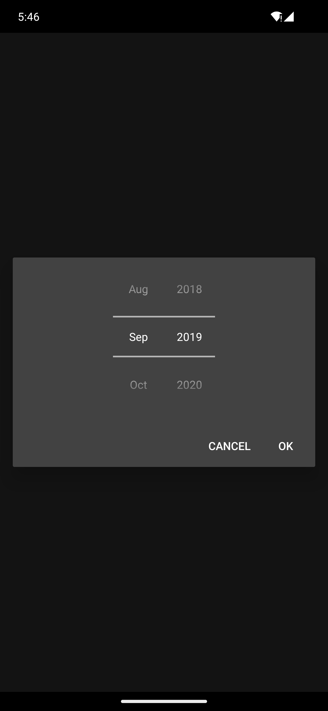

# react-native-month-year-date-picker

month year picker library based for iOS and androidOS with native support

## Installation

```sh
npm install react-native-month-year-date-picker
```

## Images

| UI Mode                       | Android                                                                | iOS                                                                |
| ----------------------------- | ---------------------------------------------------------------------- | ------------------------------------------------------------------ |
| <p align="center">**_Light_** |  |  |
| <p align="center">**_Dark_**  |   |   |

## Usage

```js
import { MonthYearDatePickerView } from 'react-native-month-year-date-picker';
```

### ShowPicker to initialize

```js
MonthYearDatePickerView.showPicker((result: {
    monthName: string;
    monthNumber: number;
    year: number;
}) => {
//    Your code you want to add
});
```

### Get Picker Value with Callback

```js
 MonthYearDatePickerView.getPickerValue(
      (result: { monthName: string; monthNumber: number; year: number }) => {
        console.log('Selected', result);
        //    Your code you want to add
      }
    );
```

### Set Picker Value(args1: Month(Oct: 10, sept:9, etc), args2: year(2024, 2093, 1996, etc))

```js
MonthYearDatePickerView.setPicker(10, 2029);
```

## Contributing

See the [contributing guide](CONTRIBUTING.md) to learn how to contribute to the repository and the development workflow.

## License

MIT

---

Made with [create-react-native-library](https://github.com/callstack/react-native-builder-bob)
